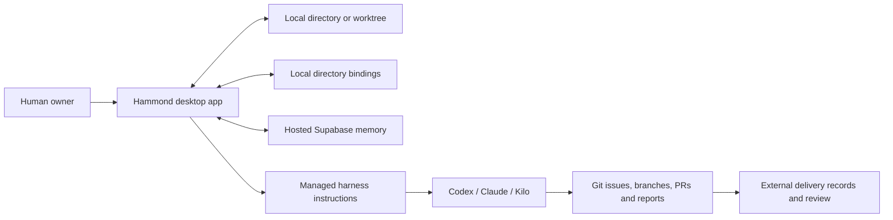

# Hammond 3.0 Architecture

D-025: retain the accepted Supabase-backed native app. Feature development is stopped; only owner-requested UI tweaks may follow. Hammond organizes projects/tasks/comments, maintains instructions and writes selected harness instruction files. It does not communicate with agents. The repository tracker is separate from app records. D-022/D-023/D-024 agent-service and disk-only directions are cancelled.

## Product boundary

Hammond is a native desktop UI for:

1. opening a local repository, worktree, or ordinary project directory;
2. remembering the Hammond project and task context associated with it;
3. managing versioned orchestrator, worker, and auditor instruction templates;
4. injecting exactly one selected instruction document per supported agent harness;
5. managing nested tasks, comments, and owner-controlled task statuses.

Hammond is not a Git client, GitHub client, provider runtime, remote bridge, or distributed control plane.

## Technology direction

- Tauri desktop shell.
- React and TypeScript UI.
- Small native filesystem command surface: select, read, write, remove, inspect existence, and reveal directory.
- Supabase Postgres for durable project memory.
- Local application settings for absolute paths, operating-system permissions, directory bindings, and last-open UI state.
- No locally served browser application and no separately installed bridge.

## Core records

- Project
- Task
- Task relation
- Comment
- Activity event
- Instruction template
- Instruction version
- Project instruction selection
- Project/task reference
- Local directory binding
- Lightweight resume session

## Session meaning

A session is where the owner left off:

- project;
- open directory;
- selected task;
- role and provider family;
- selected instruction versions;
- last screen.

It has no draft/freeze/apply/activate lifecycle.

## Instruction model

Roles:

- orchestrator;
- worker;
- auditor.

Provider families:

- OpenAI through Codex;
- Anthropic through Claude Code;
- DeepSeek through Kilo Code.

Each role and provider template is versioned in Supabase. Project and optional task instructions are composed with them. The selected adapter writes one predictable harness entry-point file. Switching role, provider, or version replaces Hammond-managed content rather than creating duplicates.

If an unmanaged target file already exists, Hammond must never silently overwrite it. It asks the owner to import, replace, or cancel.

Stable project instructions may be Git-tracked. Personal active-role state is local by default. External repository work orders are an orchestration practice, not app-generated content.

## Git and branches

Hammond does not inspect or synchronize Git.

- Same directory, different checked-out branch: same local directory context.
- Separate Git worktree: separate directory context that can link to the same Hammond project.
- Agents create branches, commits, PRs, reviews, and Git comments through their own harnesses.
- Agent reports, exact-SHA approvals, and merge authorization remain in external delivery records. Hammond may hold ordinary reference links without deriving approval or readiness.

## Supabase boundary

Durable project memory supports projects, tasks, comments, instruction templates and versions, and instruction selections. Existing schema scaffolding does not make cancelled HAM3-009/010/011 capabilities release requirements.

Supabase does not store absolute local paths. Exposed tables use owner-scoped row-level policies. The desktop app uses a persistent owner identity; there is no multi-user administration or GitHub authentication.

## Removed systems

- D1 and Miniflare
- browser-only delivery
- bridge installation and pairing
- operation polling and claims
- leases, heartbeats, outboxes, and recovery queues
- apply tokens, manifests, and runtime injection protocol
- Git discovery, dirty state, ahead/behind, and remote verification
- GitHub authentication and synchronization
- routing tiers and session role assignment
- automatic agent launching and merging

## First-release boundary

The retained app supports directory linking, nested tasks/comments/statuses, versioned instructions, assignments, injection and resume. Work orders and results may be entered manually as task comments. No agent execution, MCP, Docker or file-backed task store is delivered. Historical release plans do not authorize further development.
