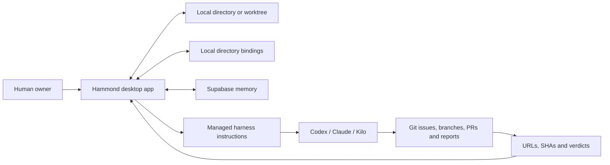

# Hammond 3.0 Architecture

Status: approved product direction; implementation not started.

## Product boundary

Hammond is a native desktop UI for:

1. opening a local repository, worktree, or ordinary project directory;
2. remembering the Hammond project and task context associated with it;
3. managing versioned orchestrator, worker, and auditor instruction templates;
4. injecting exactly one selected instruction document per supported agent harness;
5. tracking tasks, comments, reports, current head SHA, reviewed SHA, approval, merge, and shipped state.

Hammond is not a Git client, GitHub client, provider runtime, remote bridge, or distributed control plane.

## Technology direction

- Tauri desktop shell.
- React and TypeScript UI.
- Small native filesystem command surface: select, read, write, remove, inspect existence, and reveal directory.
- Supabase Postgres for durable project memory.
- Local application settings for absolute paths, operating-system permissions, directory bindings, and last-open UI state.
- No locally served browser application and no separately installed bridge.

## Core records

- Project
- Task
- Task relation
- Comment
- Activity event
- Instruction template
- Instruction version
- Project instruction selection
- Task evidence
- Local directory binding
- Lightweight resume session

## Session meaning

A session is where the owner left off:

- project;
- open directory;
- selected task;
- role and provider family;
- selected instruction versions;
- last screen.

It has no draft/freeze/apply/activate lifecycle.

## Instruction model

Roles:

- orchestrator;
- worker;
- auditor.

Provider families:

- OpenAI through Codex;
- Anthropic through Claude Code;
- DeepSeek through Kilo Code.

Each role and provider template is versioned in Supabase. Project and optional task instructions are composed with them. The selected adapter writes one predictable harness entry-point file. Switching role, provider, or version replaces Hammond-managed content rather than creating duplicates.

If an unmanaged target file already exists, Hammond must never silently overwrite it. It asks the owner to import, replace, or cancel.

Stable project instructions may be Git-tracked. Personal active-role state and generated work orders are local by default and may be excluded through `.git/info/exclude` without changing shared `.gitignore`.

## Git and branches

Hammond does not inspect or synchronize Git.

- Same directory, different checked-out branch: same local directory context.
- Separate Git worktree: separate directory context that can link to the same Hammond project.
- Agents create branches, commits, PRs, reviews, and Git comments through their own harnesses.
- Agent reports supply URLs and exact SHAs to Hammond.

## Supabase boundary

Supabase stores projects, tasks, relations, comments, instruction templates and versions, instruction selections, evidence, and activity.

Supabase does not store absolute local paths. Exposed tables use owner-scoped row-level policies. The desktop app uses a persistent owner identity; there is no multi-user administration or GitHub authentication.

## Removed systems

- D1 and Miniflare
- browser-only delivery
- bridge installation and pairing
- operation polling and claims
- leases, heartbeats, outboxes, and recovery queues
- apply tokens, manifests, and runtime injection protocol
- Git discovery, dirty state, ahead/behind, and remote verification
- GitHub authentication and synchronization
- routing tiers and session role assignment
- automatic agent launching and merging

## First-release boundary

The release is useful when the owner can open a directory, link a project, manage tasks, edit and restore instruction versions, inject or replace the selected harness instructions, resume later, generate worker/auditor work orders, record exact-SHA reports, identify stale approval, and record merge/shipped state.
